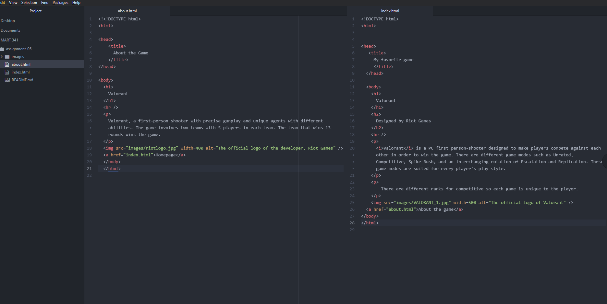

1.)I visted the website "Poptropica" using The Way Back Machine. The website is from 2011. The website older version is no longer supported by flash. However, from what I remember, the new site is a lot better. It is easier for kids to understand how to play the game. The design is also much cleaner as there is less clutter around the edges of the window.

