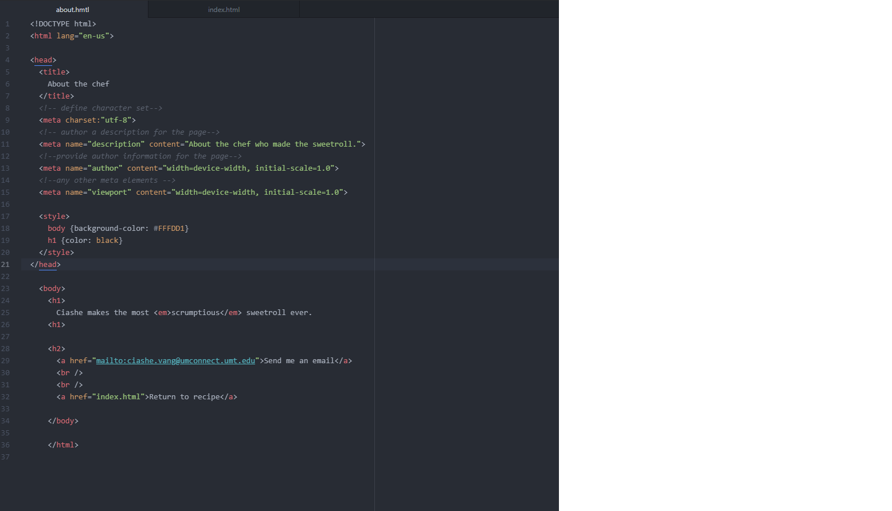
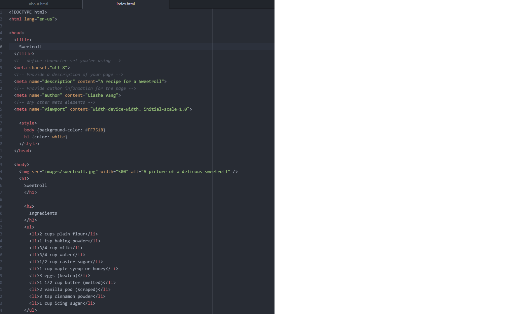

Structural markups are the elements that you can use to describe both headings and paragraphs. It is the element that tells structures the page layout. For example, where my image goes and whether the text is being read from left to right or vice versa.

Semantic markups provide extra information. It includes emphasis on a sentence and where it is placed. It basically tells everything if it is either an unordered list, ordered list, hierarchical role of the text in the document.

